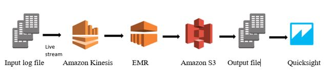
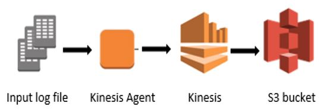
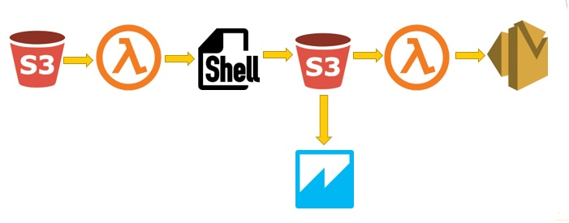

# log-monitoring
Log monitoring tool using AWS Kinesis, EMR, Quicksight, lambda functions

## Technologies used: 
AWS EMR, Kinesis, Quicksight, lambda

## Progrommed in:
Java, Node js, shell scripts

## Application overview:
1. Log monitoring tool for the application logs streamed by Kinesis.
2. Tool generates the statistics for 3 different logger levels (INFO, WARN, ERROR) using Hadoop Map Reduce program.
3. The statitsics can be visualized in quicksight using manifest.json

### High level architecture

### Phase 1 architecture

### Phase 2 architecture

